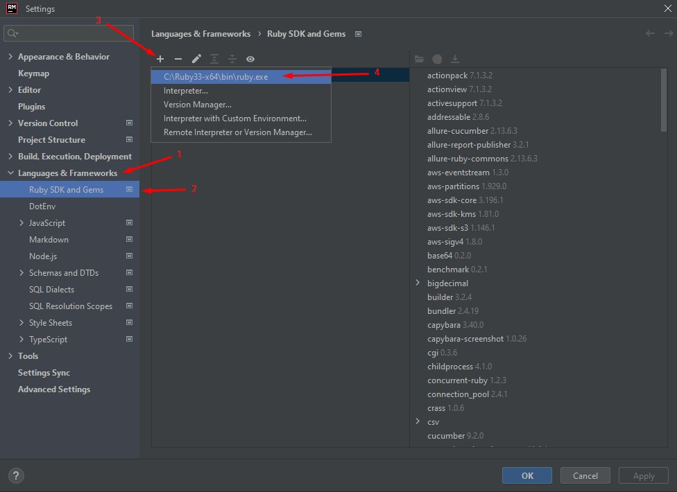
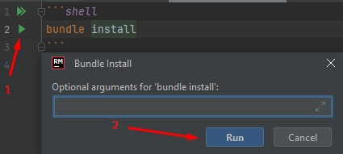

# Dmytro Krutenko's Simple Practice tech-task

## Project structure

* Ruby 3.2.4
* Selenium
* SitePrism
* Capybara
* Cucumber
* Faker
* RSpec
* Dotenv

## Instructions for setting up the framework

1) Make sure that you have installed valid version of Ruby. \
   To check your installed Ruby version, you have to type `ruby --version` in command line.

   If you don't have Ruby installed, please follow the system-specific instructions in this guide by following
   this [link to the installation instructions](https://www.ruby-lang.org/en/documentation/installation/)

Also, there is another way for **Windows** system.

* Navigate to available [Ruby Installers](https://rubyinstaller.org/downloads/)
* Select  **Ruby+Devkit 3.2.4-1 (x64)** from **RubyInstaller With DevKit** section

* Click **FILE** button in top left corner and select **Settings**
  from the dropdown or use next Hotkeys :

```
Ctrl+Alt+S
```

* Select **Languages & Framework** from available sections - 1
* Navigate to **Ruby SDK and Gems** - 2
* Click on **+** button - 3
* Select your installed Ruby - 4



2) Install required Gems manually or automatically:

#### Manual installation

* Open command line on path, for example: `C:\dkrut-simple-practice-task`
* Type `bundle install` and hit ENTER key

#### Automation installation

* Open [Bundle install](bundle-install.md) file in repository.
* Click on **green arrow** and tap on **Run** button \
  

#### This should install all the necessary Gem files for the framework

### Please make sure that you have Google Chrome browser installed

## Test Execution

### Manual way

* Navigate to feature file by following this path:

```
features/step_definitions/tests/functional/fun_add_client.feature
```

* Tap green arrow and **Run scenario**

### Using the Command Line

* You can simply type `cucumber` command to run all available cucumber tests. \
  Or you can run it through auto-executable shell command below:

```shell
cucumber
```